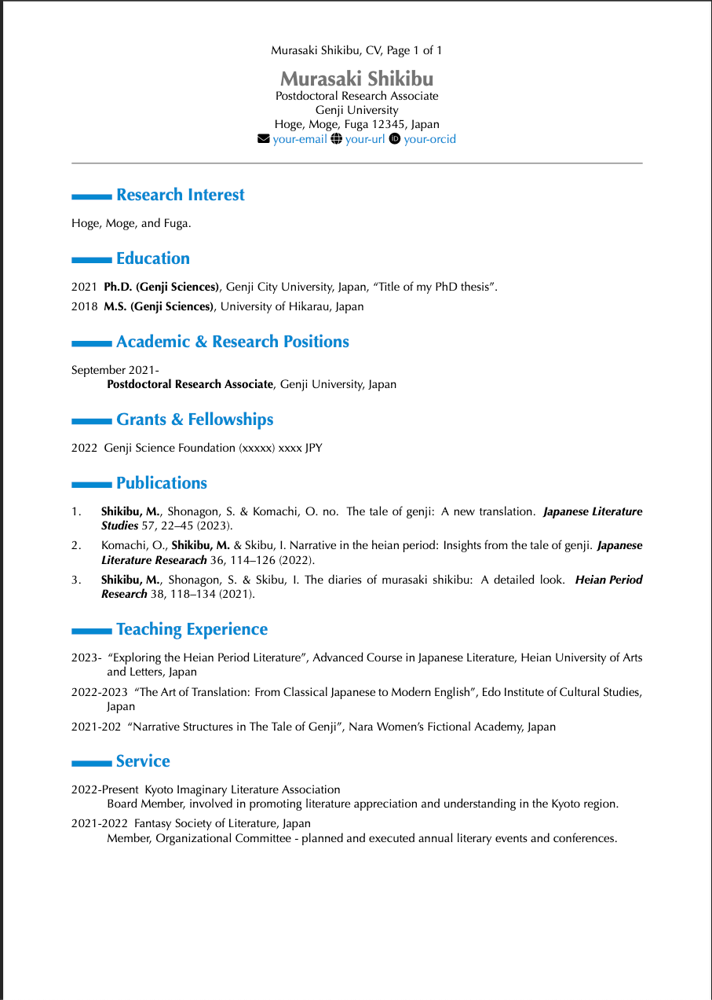

[](https://opensource.org/licenses/MIT)

# Quarto Markdown CV
---

Please note that the information here is made up for the template.

[](https://github.com/mattocci27/quarto-cv/blob/gh-pages/Shikibu_CV.pdf)

## Instructions

Customize the CV with your personal information.

```bash
vim sources/cv1.md
vim sources/cv2.md
vim sources/ref.md
vim sources/ref.bib
```

### Bibtex & metadata

This template combines a Bibtex file (`sources/ref.bib`) with metadata (`sources/ref_metadata_example.yaml`) so you can declare co-first/corresponding authors, custom replacements, and extra highlights per reference.
The `Makefile` and `.github/workflows/compile.yml` drive `scripts/ref_edit.py` with the metadata file plus the `AUTHOR` value (`Katabuchi, M.` by default), so the highlighted author stays bold while the metadata controls the †/* suffixes.
Edit `sources/ref_metadata_example.yaml` or add your own metadata file and pass it via `METADATA=` when running `make` if you want to adjust different references; install `PyYAML` before running if you need YAML parsing locally (`pip install pyyaml`).

### PDF Rendering with GitHub Actions

PDF rendering of your CV is executed automatically via GitHub Actions.
Upon any push events from the `main` branch, your CVs will be compiled, built, and deployed to the `gh-pages` branch.

The GitHub Actions workflow uses `macos-latest` because the template is designed to use the Optima font.
If you prefer to use a different operating system, such as Linux (`ubuntu-latest`), you can modify the workflow and template files and choose from other free fonts.

Please note that local building is not required for this process.
However, if you wish to build the project locally, you can use the command:

```bash
make
```

## Requirements

To compile this project locally, the following dependencies are necessary:

- [Quarto](https://quarto.org)
- [TinyTeX](https://yihui.org/tinytex/)
- PyYAML (optional, required for YAML metadata locally)
